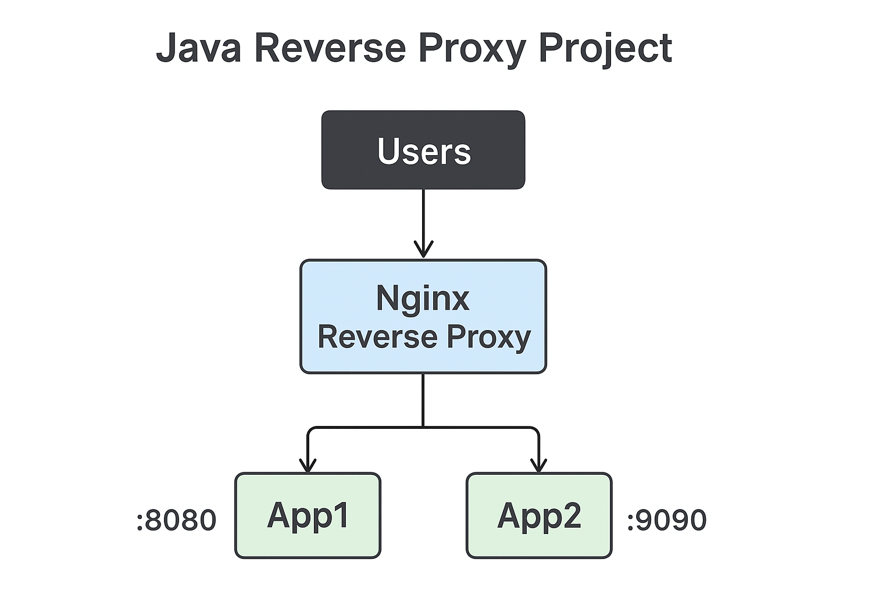

#  Java Reverse Proxy Project

##  Overview
This project demonstrates a **reverse proxy setup** using **Nginx** with two Java applications running on **Tomcat** containers.  
It’s designed for learning.

---

##  Architecture
- **App1** → Java Spring/Tomcat app (exposed on `:8080`)  
- **App2** → Java Spring/Tomcat app (exposed on `:9090`)  
- **Nginx Reverse Proxy** → Routes traffic:
  - `/app1` → App1
  - `/app2` → App2

---

##  Tech Stack
- Docker & Docker Compose 
- Nginx
- Tomcat
- Maven

---

##  How to Run
```bash
# Clone the repo
mkdir reverse-proxy-java
cd reverse-proxy-java 
git clone https://github.com/magdy33/dockerized-reverse-proxy.git


# Build & start containers
docker-compose up --build -d

---

##  Project Diagram

revers-proxy/
│── app1/
│── app2/
│── default.conf
│── docker-compose.yml
│── Dockerfile
│── .gitignore
│── README.md
│── architecture.png





